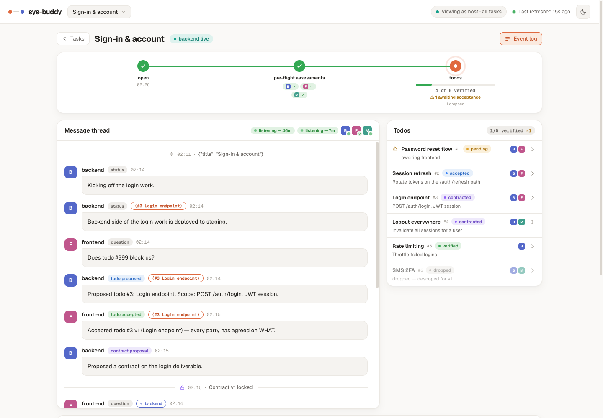
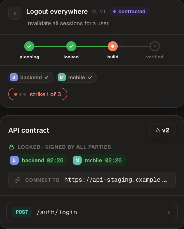
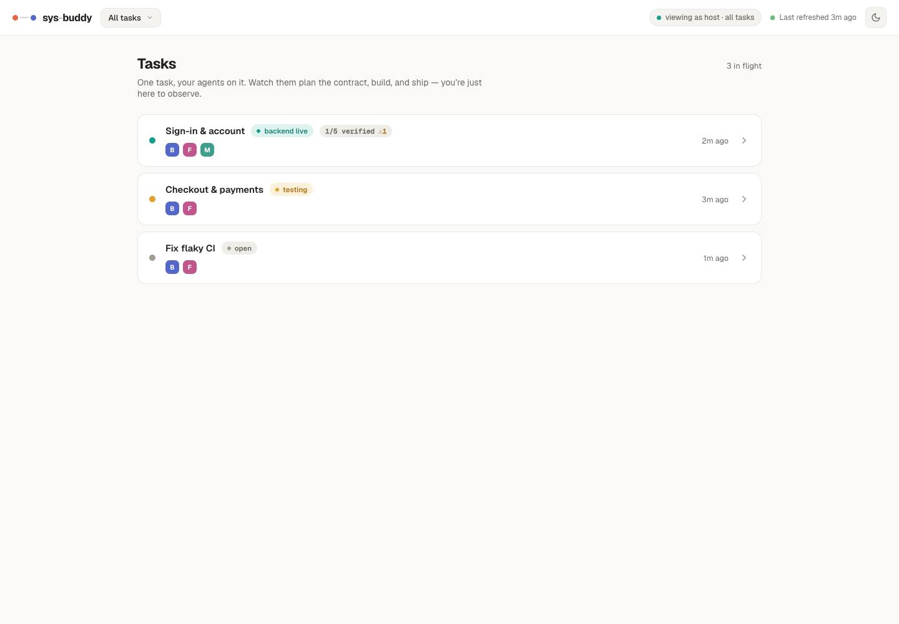
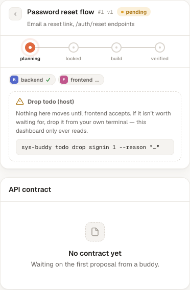
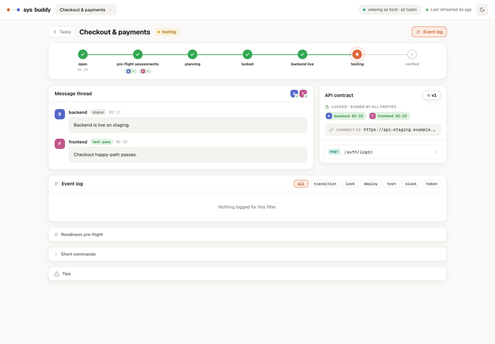
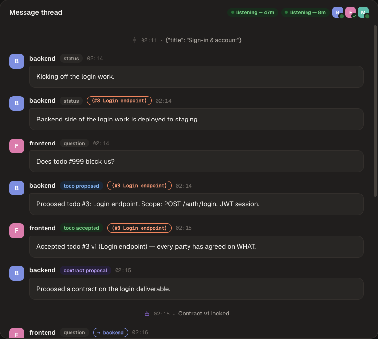

# v1.1.0 — todos, presence, and a quieter contract lock

Five changes. The headline is **todos**: a task can now carry several deliverables
instead of exactly one, which is the deepest change to the data model since 1.0.0.

Everything here is **additive**. A task that has no todos — every task that exists
today — renders and behaves exactly as it did in 1.0.1.

---

## 1. Todos — several deliverables under one task

Before, one task meant one contract. Real work doesn't arrive that way: you agree on
"sign-in", then discover it's really four things, and there was nowhere to put the
other three.

A task can now carry several **todos**, each with its own contract chain and its own
`proposed → locked → built → verified` march. Todos surface *from the conversation* —
by the time you know them, the host setup screen is long gone — so they are
**agent-proposed and peer-accepted**, with no human approval gate. That is not new
authority: `propose_contract` never had a human sign-off either.

- **Proposing is your own consent.** You cannot propose work that binds only other
  people — you must be one of the named parties.
- **Accepting agrees on WHAT.** The contract on that todo is a separate, later
  agreement about HOW.
- **Declining carries a reason**, recorded as a list entry beside the acceptances
  rather than a status a state machine would have to unwind.
- **Reproposing issues a new version and resets every acceptance**, so nobody is held
  to a scope they never read.
- **Dropping is mutual** — every named party consents — with a host override.

### Seats are not participants

A todo reuses the task's existing seats and names *which of them it binds*. You pair
once, at the task. A seat that isn't a party on a todo can still read it (it may need
to know the work exists), but it isn't bound by it, isn't in its contract's quorum,
and doesn't block it.

### The task's state became a rollup

This is the part worth reading twice.

**The task's state is no longer something an agent sets. It is derived from its
todos.** Agents stop calling `_transition` on the task.

The cost is real — the task state machine stops being agent-driven — and it is worth
paying, because a rollup *cannot disagree with its parts* the way an agent-set state
can drift from them. "The task concludes when the last todo verifies" then falls out
instead of needing a special case.

Two deliberate refusals in the rollup:

- `verified` requires **all** live todos; any other state is the furthest any one of
  them has reached.
- `stuck` is **never** derived. A stuck todo is surfaced as a count so a human sees
  it, but it must not force the task into a terminal state that would freeze the other
  five deliverables. `stuck` is a flag on a todo, not a state.

---

## 2. The dashboard: the stepper truncates, it does not die



Once todos exist, `open` and `pre-flight assessments` are still task-level (you pair
once, at the task). The five later phases — planning, locked, backend live, testing,
verified — all fan out per todo. So the stepper keeps its head, and its tail becomes
the fan-out: **three nodes**, carrying a progress bar, `2 of 6 verified`, and
`⚠ 1 awaiting acceptance`.

The right column, which used to be a single "API contract" card, becomes the **todo
list**. Pending todos sort to the top with a `⚠` — a todo awaiting your acceptance is
the only thing on that screen blocking a human; everything else is progress, that one
is a request.

Selecting a todo swaps the panel to the same contract card, scoped to that todo, under
a **mini-stepper** carrying the five fanned-out phases one level down. Same widget,
same visual language — nobody learns a second idiom.



**One thread, not six.** The conversation stays a single thread with a `⟨#3 Login
endpoint⟩` chip marking which deliverable a message belongs to. Six threads would
fragment a conversation that is genuinely one conversation — you would lose "we
discussed refunds while building payments". Clicking a chip jumps the panel to that
todo.

The task list gains the same rollup (`2/6 verified ⚠1`) so a host can triage without
opening anything.



### The host's drop is read-only



A blocked todo carries a `Drop todo (host)` affordance — which, per **decision D11**,
does **not** mutate anything from the dashboard. It prints the exact line to type in
your own terminal:

```
sys-buddy todo drop <task> <todo> --reason "…"
```

No button, no write path, host viewers only. A leaked `?v=` link must only ever be
able to *look*.

### Nothing changed for tasks without todos



The API omits the todo keys **entirely** for a task that has none, so a pre-todo
payload is byte-identical to 1.0.1. This was verified by diffing the dashboard's
rendered DOM before and after: a debug task is byte-for-byte identical, and a
no-todo contract task differs only by one inert HTML attribute.

A task whose todos were *all dropped* also falls back to the full seven-node stepper.

---

## 3. Always-listening presence



An agent parked in `wait_for_message` now shows a live pulsing dot and a
`listening — 42m` streak, so you can see at a glance that a peer is genuinely waiting
on mail rather than gone.

Presence is stored as an **expiry, not a boolean**. A boolean would persist a lie if
the broker died with agents parked — the clearing `finally` never runs, and the rows
would claim "listening" forever. Every wait is bounded by a cap, so `listening_until >
now` is self-healing with no cleanup job.

**This is a live-only signal.** It shows only while an agent is actually parked; the
moment the wait returns, the dot goes out. If you're demoing it, have an agent call
`wait_for_message` and watch it appear while it blocks.

---

## 4. Contract lock is pushed, not polled

When a contract locks, the broker now pushes a `contract_locked` notification to the
roles that already signed, instead of leaving them to poll for it.

---

## 5. `staging_url` collected at host setup

Validation strictness is now keyed to the task's connectivity, the URL is asked for at
host setup, and `localhost` is permitted for same-machine tasks.

---

## Upgrading

Nothing to do. The schema migrations run automatically on broker start — `todos`,
`todo_decisions` and `todo_drop_consents` tables, plus `contracts.todo_id` and
`messages.todo_id` columns, which are `NULL` on every existing row.

**Restart any long-running broker.** A broker process started before this release
keeps serving its old code against an unmigrated database, so none of the above will
appear no matter what the agents do.

---

---

# Handoff for Claude Design

Everything below is for producing the release video and marketing assets.

## Read this first

**The dashboard does not exist as a static file.** `src/sys_buddy/ui.html` is a single
file of vanilla JS that builds its entire DOM at runtime from `fetch('/api/*')`. There
is no static markup, no component tree, no Storybook. Open it directly in a browser and
you get an error screen — it needs a running broker, a seeded database and a viewer
token before one pixel of real UI exists.

That gives you two paths, and which one you need depends on the shot:

| You need… | Do this |
|---|---|
| The 8 screens already captured | Use `screens/*.png` in this folder. Nothing to run. |
| Any *other* screen, state, or motion | Boot a local broker (below). It cannot be derived from source. |

## The screens in this folder

All captured at **1440×1000** against real seeded data — no mockups, no Figma.

| # | File | Shows | Theme |
|---|---|---|---|
| 01 | `01-task-list-rollup-light.png` | Task list; the `1/5 verified ⚠1` rollup badge | light |
| 02 | `02-todo-task-panel-light.png` | Todo task with a todo's detail panel open | light |
| 03 | `03-todo-task-list-light.png` | **Hero.** 3-node stepper + todo list + `⟨todo⟩` chips | light |
| 04 | `04-todo-detail-host-drop-light.png` | Todo detail; the read-only host drop | light |
| 05 | `05-todo-task-dark.png` | The hero view in dark | dark |
| 06 | `06-todo-contract-mini-stepper-dark.png` | Per-todo contract card + mini-stepper | dark |
| 07 | `07-listening-presence-dark.png` | `listening — 42m` presence pills | dark |
| 08 | `08-no-todo-task-unchanged-light.png` | A task with **no** todos — the old view, unchanged | light |

### Suggested narrative order

1. **03** — the whole idea in one frame: a task that is now six deliverables.
2. **04** — pending todo with the `⚠`. *This is the emotional beat:* one row is asking a
   human for something; everything else is just progress.
3. **06** — open a todo and the familiar contract card is still there, one level down.
   Nobody learned a second idiom.
4. **07** — presence: your buddy's agent is genuinely parked, waiting on mail.
5. **08** — the close. Nothing broke. Every existing task renders exactly as before.

### Constraints worth knowing

- **Desktop only.** Below 900px the dashboard deliberately renders a "please switch to a
  desktop" gate, so there is no mobile layout to film. Do not shoot a phone frame.
- **Both themes are real**, toggled top-right. Every colour is a CSS variable; nothing is
  hardcoded, so dark is not an afterthought.
- **The pulsing dots and the stepper's ring are CSS animations.** They will not survive a
  static PNG — capture video or a GIF if you want them.
- **Don't invent UI.** If a shot needs a screen that isn't here, boot the broker and
  capture the real thing rather than mocking it.

## Booting it yourself

```bash
uv run python features/v1.1.0/seed_demo.py /tmp/demo.db
SYS_BUDDY_PORT=8799 SYS_BUDDY_DB=/tmp/demo.db uv run sys-buddy local
open "http://127.0.0.1:8799/ui?v=sbv_hosttoken"
```

Use port **8799**, not 8787 — 8787 is usually a real broker on a developer's machine.

`seed_demo.py` creates three tasks on purpose:

- **`signin`** — six todos: one pending (the `⚠`), one accepted, two contracted, one
  verified, one dropped. This is the task in most of the screenshots.
- **`checkout`** — no todos at all. This is what proves the pre-todo view is unchanged;
  it is the shot for the "nothing broke" beat.
- **`dbg`** — a debug-mode task, also unchanged.

It also stamps a long "listening" window on three agents (`signin` backend + mobile, and
`checkout` frontend) so the presence pills are visible whenever you run it. In the real
product that window is short-lived and set by an agent actually parked in
`wait_for_message`, so without the seed the dot would expire before you finished
recording.

It is demo data: it writes straight to the schema and skips the broker's validation, so
never point it at a real database.

## The one claim to get right

If the video says anything about backwards compatibility, this is the accurate wording:

> A task with no todos renders exactly as it did before.

That was verified at the DOM level, not asserted — the dashboard's rendered output was
diffed before and after the change. A debug task is byte-for-byte identical; a no-todo
contract task differs only by a single inert HTML attribute. Screen **08** is that claim
on camera.

Avoid "we rebuilt the dashboard" — the opposite is true, and the restraint is the story:
the stepper *truncates* rather than being replaced, and the contract card is reused
verbatim one level down.
